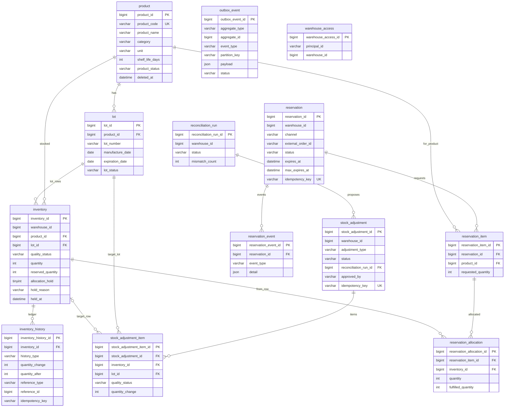

# ERD

inventory 서비스 데이터 모델이다. 공통 규칙과 컬럼 표기는 WMS(`dozy-wms-api`)의 DDL을 따른다.
DDL 원본은 `src/main/resources/db/migration`이다(`V1__create_schema.sql`은 테이블·유니크·CHECK·인덱스, `V2__add_foreign_keys.sql`은 외래키). 이 문서는 설명과 설계 결정을 맡는다.

## 1. 설계 규칙

| 항목 | 규칙 |
|------|------|
| 기본키 | 모든 테이블 `BIGINT AUTO_INCREMENT` (ERD-01). WMS와 같은 값 체계라 상품 ID를 그대로 승계할 수 있다. |
| 감사 컬럼 | `created_at`, `created_by`, `updated_at`, `updated_by` (`DATETIME(6)`, `VARCHAR(100)`). 이력·원장성 테이블(`inventory_history`, `reservation_event`, `outbox_event`)은 변경하지 않으므로 `created_*`만 둔다. |
| enum | `VARCHAR(50)` 컬럼에 컬럼별 `CHECK` (`ck_{table}_{column}`). 애플리케이션의 Kotlin enum 상수 이름을 그대로 저장한다. enum을 바꾸면 CHECK 제약 마이그레이션이 필요하다. |
| 외부 서비스 데이터 | `warehouse_id`, 요청자 같은 외부 값은 ID 컬럼만 두고 FK를 걸지 않는다. |
| 소프트 삭제 | `product`에만 둔다. `inventory`는 수량이 0이 되어도 행을 유지한다 (ERD-03). |
| 멱등 키 | 별도 테이블 없이 도메인 테이블의 유니크 제약으로 보장한다 (ERD-05). |
| 설정값 | 예약 TTL 상한(채널별), 조정 승인 임계치는 테이블이 아니라 애플리케이션 설정으로 둔다. |
| 수량 검증 | 수량 불변식은 도메인 모델이 지키고 DB `CHECK`가 마지막 안전망이다. |
| DB | MySQL 8.0, 스키마 `dozy_inventory` |
| 마이그레이션 | 적용된 파일은 수정하지 않고 새 버전 파일을 추가한다. 테이블은 V1, 외래키는 V2에 둔다. |

## 2. ERD 다이어그램



`outbox_event`와 `warehouse_access`는 다른 테이블과 FK로 연결되지 않는다(이벤트 발행·수신 전용).

## 3. 테이블 정의

표기: PK/FK는 키, NULL 열의 `N`은 NOT NULL, `Y`는 NULL 허용. "(감사 컬럼 4개)"는 `created_at`, `created_by`, `updated_at`, `updated_by`이다.

### 3.1 마스터

#### product — 상품 마스터

| 컬럼 | 타입 | NULL | 설명 |
|------|------|------|------|
| product_id | BIGINT PK | N | WMS 상품 ID를 그대로 승계 |
| product_code | VARCHAR(50) | N | 유니크 |
| product_name | VARCHAR(100) | N | |
| category | VARCHAR(50) | N | `BEAN`, `SYRUP`, `POWDER`, `DAIRY`, `SUPPLY`, `MD`. 카테고리 → Zone 매핑은 WMS 소관 |
| unit | VARCHAR(20) | N | |
| shelf_life_days | INT | Y | 0 이상, 없으면 유통기한 없는 상품 |
| product_status | VARCHAR(50) | N | `ACTIVE`, `INACTIVE` |
| deleted_at, deleted_by | DATETIME(6), VARCHAR(100) | Y | 소프트 삭제 |
| (감사 컬럼 4개) | | N | |

제약: `uq_product_code (product_code)`

#### lot — Lot (공급사 Lot 번호 단위)

| 컬럼 | 타입 | NULL | 설명 |
|------|------|------|------|
| lot_id | BIGINT PK | N | |
| product_id | BIGINT FK | N | `product` |
| lot_number | VARCHAR(50) `utf8mb4_bin` | N | 공급사가 부여한 번호. inventory 서비스는 생성하지 않음. 대소문자를 구분한다 (ERD-08) |
| manufacture_date | DATE | Y | |
| expiration_date | DATE | Y | |
| lot_status | VARCHAR(50) | N | `NORMAL`, `EXPIRING_SOON`, `EXPIRED` |
| (감사 컬럼 4개) | | N | |

제약: `uq_lot_product_number (product_id, lot_number)`, `uq_lot_id_product (lot_id, product_id)`(inventory가 참조), `chk_lot_expiration_date`(유통기한 ≥ 제조일자)
인덱스: `idx_lot_expiration_date (expiration_date)` — 유통기한 스캔

### 3.2 재고

#### inventory — 창고 × Lot × 품질 상태 단위 재고

| 컬럼 | 타입 | NULL | 설명 |
|------|------|------|------|
| inventory_id | BIGINT PK | N | |
| warehouse_id | BIGINT | N | 외부(WMS) 창고 ID. FK 없음 |
| product_id | BIGINT FK | N | 조회 인덱스용 비정규화. `(lot_id, product_id)`로 lot과 일관성 보장 |
| lot_id | BIGINT FK | N | |
| quality_status | VARCHAR(50) | N | `NORMAL`, `DEFECTIVE`, `DISPOSAL_SCHEDULED` |
| quantity | INT | N | 총 수량(on-hand), 기본 0 |
| reserved_quantity | INT | N | 예약 수량, 기본 0 |
| allocation_hold | TINYINT(1) | N | 할당 보류, 기본 0 (ERD-04) |
| hold_reason | VARCHAR(100) | Y | 보류 사유 |
| held_at | DATETIME(6) | Y | 보류 시각 |
| (감사 컬럼 4개) | | N | |

- 제약: `uq_inventory_row (warehouse_id, lot_id, quality_status)`, `chk_inventory_quantity (quantity >= 0)`, `chk_inventory_reserved (reserved_quantity >= 0 AND reserved_quantity <= quantity)`, `chk_inventory_hold (allocation_hold = 0 OR held_at IS NOT NULL)`, FK `(lot_id, product_id)` → `lot`
- 인덱스: `idx_inventory_available (warehouse_id, product_id, quality_status)` — 가용 조회, Lot 할당 후보 조회
- 가용 수량 = `quantity - reserved_quantity` (파생). `quality_status = NORMAL` 이고 `allocation_hold = 0` 인 행만 가용에 포함한다.
- 수량이 0이 되어도 행을 삭제하지 않는다 (ERD-03).

#### inventory_history — 수량 변동 원장

| 컬럼 | 타입 | NULL | 설명 |
|------|------|------|------|
| inventory_history_id | BIGINT PK | N | |
| inventory_id | BIGINT FK | N | `inventory` |
| history_type | VARCHAR(50) | N | `INBOUND`, `RETURN`, `OUTBOUND`, `DISPOSAL`, `ADJUSTMENT`, `RECONCILIATION`, `QUALITY_TRANSFER` |
| quantity_change | INT | N | 0이 아닌 변동량(증가 +, 감소 −) |
| quantity_after | INT | N | 변경 후 총 수량(예약 수량 제외, ERD-02) |
| reference_type | VARCHAR(50) | N | 원인 문서 유형 (`INBOUND_ITEM`, `RETURN_ITEM`, `RESERVATION`, `DISPOSAL_ITEM`, `STOCK_ADJUSTMENT_ITEM`, `LOT_EXPIRATION`) |
| reference_id | BIGINT | N | 원인 문서 ID (WMS 문서 또는 inventory 서비스 문서) |
| idempotency_key | VARCHAR(100) `ascii_bin` | N | 요청의 멱등 키 (ERD-07) |
| requester_service | VARCHAR(50) | N | 요청 서비스(`svc-wms`, `scheduler` 등) |
| created_at, created_by | DATETIME(6), VARCHAR(100) | N | 변경 불가. `created_by`는 요청자 principal 또는 `system` |

- 제약: `uq_history_idempotency (idempotency_key, inventory_id)`, `chk_history_change (quantity_change <> 0)`, `chk_history_after (quantity_after >= 0)`
- 인덱스: `idx_history_inventory_created (inventory_id, created_at)`, `idx_history_reference (reference_type, reference_id)`
- `QUALITY_TRANSFER`는 두 행(전환 전·후)에 각각 −N, +N으로 기록한다 (ERD-06). 이 유형은 재고 증감 이벤트를 발행하지 않는다.

### 3.3 예약

#### reservation — 주문 단위 예약

| 컬럼 | 타입 | NULL | 설명 |
|------|------|------|------|
| reservation_id | BIGINT PK | N | |
| warehouse_id | BIGINT | N | 외부(WMS) 창고 ID |
| channel | VARCHAR(50) | N | 🔶 미정. 호출 채널을 식별하는 값이며 채널 종류와 값이 확정되기 전이라 `CHECK` 제약 없이 둔다(`OMS`, `STORE`는 가정). 채널별 TTL 상한 적용 기준 |
| external_order_id | VARCHAR(100) | N | 호출 채널의 주문 ID |
| status | VARCHAR(50) | N | `RESERVED`, `CONFIRMED`, `RELEASED`, `EXPIRED`, `FULFILLED` |
| expires_at | DATETIME(6) | Y | 확정 전 만료 시각. 확정 후에는 NULL |
| max_expires_at | DATETIME(6) | N | 생성 시각 + 채널 상한. 연장해도 넘을 수 없음 |
| confirmed_at | DATETIME(6) | Y | |
| idempotency_key | VARCHAR(100) `ascii_bin` | N | 유니크 (ERD-07) |
| requester_service | VARCHAR(50) | N | |
| (감사 컬럼 4개) | | N | |

- 제약: `uq_reservation_idempotency (idempotency_key)`, `chk_reservation_expiry (status <> 'RESERVED' OR (expires_at IS NOT NULL AND expires_at <= max_expires_at))`
- 인덱스: `idx_reservation_expiry (status, expires_at)` — 만료 스캔, `idx_reservation_order (channel, external_order_id)`

#### reservation_item — 상품별 요청 수량

| 컬럼 | 타입 | NULL | 설명 |
|------|------|------|------|
| reservation_item_id | BIGINT PK | N | |
| reservation_id | BIGINT FK | N | |
| product_id | BIGINT FK | N | |
| requested_quantity | INT | N | 1 이상 |
| (감사 컬럼 4개) | | N | |

제약: `uq_reservation_item (reservation_id, product_id)`

#### reservation_allocation — Lot(재고 행)별 할당

| 컬럼 | 타입 | NULL | 설명 |
|------|------|------|------|
| reservation_allocation_id | BIGINT PK | N | |
| reservation_item_id | BIGINT FK | N | |
| inventory_id | BIGINT FK | N | 할당된 재고 행(Lot) |
| quantity | INT | N | 현재 할당 수량. 재할당으로 줄 수 있음(0 이상) |
| fulfilled_quantity | INT | N | 출고 확정된 수량, 기본 0 |
| (감사 컬럼 4개) | | N | |

- 제약: `uq_allocation (reservation_item_id, inventory_id)`, `chk_allocation_quantity (quantity >= 0 AND fulfilled_quantity >= 0 AND fulfilled_quantity <= quantity)`
- 인덱스: `idx_allocation_inventory (inventory_id)`
- `inventory.reserved_quantity`는 이 테이블의 미출고 합계(`quantity − fulfilled_quantity`, 해제되지 않은 예약)와 일치해야 한다.

#### reservation_event — 예약 이벤트 이력

| 컬럼 | 타입 | NULL | 설명 |
|------|------|------|------|
| reservation_event_id | BIGINT PK | N | |
| reservation_id | BIGINT FK | N | |
| event_type | VARCHAR(50) | N | `CREATED`, `EXTENDED`, `CONFIRMED`, `RELEASED`, `EXPIRED`, `FORCE_RELEASED`, `REALLOCATED`, `FULFILLED` |
| detail | JSON | Y | 사유, 변경 전·후 만료 시각, 재할당 Lot 등 |
| created_at, created_by | DATETIME(6), VARCHAR(100) | N | 변경 불가 |

인덱스: `idx_reservation_event (reservation_id, created_at)`

### 3.4 조정·대사

#### stock_adjustment — 조정 요청 (실사 조정, 대사 보정)

| 컬럼 | 타입 | NULL | 설명 |
|------|------|------|------|
| stock_adjustment_id | BIGINT PK | N | |
| warehouse_id | BIGINT | N | |
| adjustment_type | VARCHAR(50) | N | `AUDIT`(실사 조정), `RECONCILIATION`(대사 보정) |
| status | VARCHAR(50) | N | `PENDING`, `APPROVED`, `REJECTED`, `APPLIED`. `AUDIT`는 요청 즉시 `APPLIED` |
| external_reference_id | BIGINT | Y | `AUDIT`: WMS 실사 건 ID |
| reconciliation_run_id | BIGINT FK | Y | `RECONCILIATION`: 대사 실행 |
| requested_by | VARCHAR(100) | N | 요청자 또는 `system` |
| approved_by, approved_at | VARCHAR(100), DATETIME(6) | Y | 승인자·승인 시각 |
| idempotency_key | VARCHAR(100) `ascii_bin` | N | 유니크 (ERD-07). 대사 보정은 실행·항목에서 생성한 키 |
| (감사 컬럼 4개) | | N | |

- 제약: `uq_adjustment_idempotency (idempotency_key)`, `chk_adjustment_approval (adjustment_type = 'AUDIT' OR status NOT IN ('APPROVED','APPLIED') OR approved_by IS NOT NULL)` — 대사 보정은 임계치와 무관하게 항상 승인자 필요
- `AUDIT`에서 승인이 필요한 항목(변동량 > 임계치)이 하나라도 있으면 `approved_by`를 요구하는 규칙은 애플리케이션이 검증한다.

#### stock_adjustment_item — 항목별 변동량

| 컬럼 | 타입 | NULL | 설명 |
|------|------|------|------|
| stock_adjustment_item_id | BIGINT PK | N | |
| stock_adjustment_id | BIGINT FK | N | |
| inventory_id | BIGINT FK | Y | 대상 재고 행. 행이 아직 없으면 NULL이고 반영 때 생성 |
| lot_id | BIGINT FK | N | |
| quality_status | VARCHAR(50) | N | 대상 품질 상태 |
| quantity_change | INT | N | 0이 아닌 변동량 |
| inventory_quantity, wms_quantity | INT | Y | `RECONCILIATION`: 보정안 생성 시점의 양쪽 수량 |
| (감사 컬럼 4개) | | N | |

제약: `uq_adjustment_item (stock_adjustment_id, lot_id, quality_status)`, `chk_adjustment_item_change (quantity_change <> 0)`

#### reconciliation_run — 일 1회 대사 실행

| 컬럼 | 타입 | NULL | 설명 |
|------|------|------|------|
| reconciliation_run_id | BIGINT PK | N | |
| warehouse_id | BIGINT | N | |
| status | VARCHAR(50) | N | `RUNNING`, `COMPLETED`, `FAILED` |
| started_at, finished_at | DATETIME(6) | N, Y | |
| checked_count, mismatch_count | INT | N | 비교한 항목 수, 불일치 수 |
| (감사 컬럼 4개) | | N | |

인덱스: `idx_reconciliation_run (warehouse_id, started_at)`

### 3.5 인프라

#### outbox_event — 발행 대기 이벤트

| 컬럼 | 타입 | NULL | 설명 |
|------|------|------|------|
| outbox_event_id | BIGINT PK | N | 발행 순서의 기준 |
| aggregate_type | VARCHAR(50) | N | `INVENTORY`, `RESERVATION`, `LOT`, `PRODUCT`, `ADJUSTMENT` |
| aggregate_id | BIGINT | N | |
| event_type | VARCHAR(100) | N | 이벤트 이름의 코드 값 |
| partition_key | VARCHAR(100) | N | Kafka 파티션 키(`창고ID:상품ID`). 같은 키는 순서를 보장 |
| payload | JSON | N | |
| status | VARCHAR(50) | N | `PENDING`, `PUBLISHED` |
| attempt_count | INT | N | 발행 시도 횟수 |
| created_at, published_at | DATETIME(6) | N, Y | |

- 인덱스: `idx_outbox_pending (status, outbox_event_id)` — 발행 대기 조회. 같은 `partition_key`는 `outbox_event_id` 순서로 발행한다.
- 발행 완료된 행은 일정 기간 뒤 삭제하는 정리 배치를 둔다.

#### warehouse_access — 직원의 창고 소속 사본

| 컬럼 | 타입 | NULL | 설명 |
|------|------|------|------|
| warehouse_access_id | BIGINT PK | N | |
| principal_id | VARCHAR(36) | N | `dozy-auth` principalId(UUID) |
| warehouse_id | BIGINT | N | 외부(WMS) 창고 ID |
| (감사 컬럼 4개) | | N | WMS 이벤트 수신 시각이 `updated_at` |

- 제약: `uq_warehouse_access (principal_id, warehouse_id)`
- WMS의 소속 변경 이벤트로 추가·삭제한다. 사본이 없으면 접근을 거부하고 소속 사본 없음을 로그·알림으로 남긴다.

## 4. 시나리오와의 대응

| 시나리오 | 주로 쓰는 테이블 |
|----------|------------------|
| 입고 확정 반영 | `product`, `lot`(처음 수신 시 등록), `inventory`(upsert), `inventory_history`(`INBOUND`), `outbox_event` |
| 재고 조회 | `inventory`, `lot`, `inventory_history`, `reservation_event` |
| 재고 예약 | `reservation`, `reservation_item`, `reservation_allocation`, `inventory`, `reservation_event`, `outbox_event` |
| 출고 확정 | `reservation_allocation`, `inventory`, `inventory_history`(`OUTBOUND`), `reservation`, `outbox_event` |
| Lot 재할당 | `reservation_allocation`, `inventory`(`allocation_hold`), `reservation_event`(`REALLOCATED`) |
| 반품 복귀 | `inventory`, `inventory_history`(`RETURN`) |
| 실사 조정 | `stock_adjustment`(`AUDIT`), `stock_adjustment_item`, `inventory`, `inventory_history`(`ADJUSTMENT`), 보류 해제 |
| 대사 보정 | `reconciliation_run`, `stock_adjustment`(`RECONCILIATION`), `stock_adjustment_item`, `inventory_history`(`RECONCILIATION`) |
| 유통기한 스캔 | `lot`(상태), `inventory`(품질 전환), `inventory_history`(`QUALITY_TRANSFER`), `reservation`·`reservation_event`(강제 해제), `outbox_event` |
| 폐기 확정 | `inventory`, `inventory_history`(`DISPOSAL`) |
| 이벤트 발행 | `outbox_event` |
| 인증·창고 접근 | `warehouse_access` |

핵심 쿼리 패턴은 [concurrency-and-idempotency.md](concurrency-and-idempotency.md)에 있다. 가용 재고 조회는 다음과 같다.

```sql
SELECT product_id, SUM(quantity - reserved_quantity) AS available
  FROM inventory
 WHERE warehouse_id = :warehouseId
   AND product_id IN (:productIds)
   AND quality_status = 'NORMAL'
   AND allocation_hold = 0
 GROUP BY product_id;
```

## 5. ERD 설계 결정

### ERD-01. 기본키는 BIGINT 자동 증가

- **결정**: 모든 테이블 PK는 `BIGINT AUTO_INCREMENT`.
- **이유**: WMS와 같은 값 체계라 상품 ID를 그대로 승계할 수 있고 컨벤션이 같다.
- **대안**: UUID v7(추측이 어렵고 분산 생성 가능하지만 WMS와 체계가 달라지고 상품 ID 승계가 어려움).
- **감수하는 것**: 순차 값이라 추측이 쉬우므로 모든 API에서 리소스 인가를 반드시 한다.

### ERD-02. 재고 이력에 변경 후 수량을 저장

- **결정**: `inventory_history.quantity_after`에 변경 후 총 수량(예약 수량 제외)을 저장한다.
- **이유**: 이력 한 줄로 특정 시점 수량을 확인하고 대사 불일치의 원인을 추적한다. 조건부 갱신 뒤 새 수량을 읽으므로 구현 비용이 없다.
- **감수하는 것**: 이력과 현재 수량이 어긋나지 않도록 같은 트랜잭션에서 기록해야 한다.

### ERD-03. 수량 0 행은 삭제하지 않고 유지

- **결정**: `inventory` 행은 0이 되어도 유지하고 소프트 삭제 컬럼을 두지 않는다.
- **이유**: 같은 키의 재고가 다시 들어오면 그 행에 더하면 되고, 유니크 제약과 이력 FK 무결성이 단순하게 유지된다. MySQL은 부분 유니크를 지원하지 않아 소프트 삭제는 생성 컬럼 우회가 필요하다.
- **감수하는 것**: 0인 행이 남는다(Lot당 최대 3행). 조회는 총 수량·예약 수량이 모두 0인 행을 기본 제외하고, 필요하면 오래된 0행 정리 배치를 추가한다.

### ERD-04. 할당 보류는 inventory 컬럼으로 관리

- **결정**: `allocation_hold`, `hold_reason`, `held_at` 컬럼으로 보류를 표현한다.
- **이유**: 보류는 드문 예외이고 가장 자주 쓰는 Lot 할당 조회가 `allocation_hold = 0` 한 조건으로 끝난다.
- **감수하는 것**: 지난 보류 이력이 남지 않는다. 보고 사실은 `reservation_event`(`REALLOCATED`)에, 해제는 조정 이력에 간접적으로 남는다. 감사 요구가 생기면 `inventory_hold` 테이블로 확장한다.

### ERD-05. 멱등 키는 도메인 테이블의 유니크 제약

- **결정**: `reservation`, `stock_adjustment`, `inventory_history`에 멱등 키를 두고 유니크 제약으로 중복을 막는다. 이전 결과는 도메인 데이터에서 다시 만들어 반환한다.
- **이유**: 이력에 변경 후 수량이 있어 응답을 재구성할 수 있다. 테이블이 늘지 않고 중복 방지를 DB가 직접 보장하며 WMS ADR-0008의 선례와 같다.
- **감수하는 것**: 같은 키에 다른 내용이 오는 경우는 저장된 도메인 행과 비교하는 애플리케이션 로직으로 거부해야 한다. 한 요청이 여러 행을 건드리는 경우를 위해 이력의 유니크는 `(idempotency_key, inventory_id)` 조합이다.

### ERD-06. 품질 상태 전환도 재고 이력으로 기록

- **결정**: 품질 상태 전환(예: 정상 → 폐기 예정)은 `QUALITY_TRANSFER` 이력으로 전환 전 행에 −N, 전환 후 행에 +N을 각각 기록한다. 재고 증감 이벤트는 발행하지 않고 `Lot 경과` 이벤트만 발행한다.
- **이유**: inventory 서비스는 품질 상태가 재고 행 키의 일부라서 전환 시 수량이 행 사이로 옮겨간다. 이력을 남기지 않으면 행별 이력 합계가 현재 수량과 어긋나고 `quantity_after`의 연속성이 깨진다.
- **감수하는 것**: 이력 유형이 하나 늘고, 이력 조회에서 전환과 실제 수량 변동을 구분해 표시해야 한다.

### ERD-07. 멱등 키는 `VARCHAR(100)` ASCII, 대소문자 구분

- **결정**: 멱등 키 컬럼은 `VARCHAR(100) CHARACTER SET ascii COLLATE ascii_bin`이다. 호출자는 키를 ASCII 문자열(UUID 또는 `서비스-문서-ID` 형태)로 만든다.
- **이유**: DB 기본 collation(`utf8mb4_unicode_ci`)은 대소문자를 구분하지 않아 `abc-1`과 `ABC-1`이 같은 키로 취급되고, 서로 다른 요청이 중복으로 오인된다. `ascii`는 문자당 1바이트라 계속 쌓이는 `inventory_history`의 유니크 인덱스가 작다(최대 100바이트).
- **감수하는 것**: 호출 서비스가 ASCII 키 규칙을 지켜야 한다. 100자를 넘는 키는 거부된다.

### ERD-08. 공급사 Lot 번호는 대소문자를 구분

- **결정**: `lot.lot_number`는 `utf8mb4_bin`으로 대소문자를 구분한다. `(product_id, lot_number)` 유니크도 이 비교를 따른다.
- **이유**: inventory 서비스는 공급사 번호를 변형하지 않는다. 대소문자만 다른 서로 다른 Lot이 합쳐지면 유통기한이 섞이는 조용한 오류가 생긴다.
- **감수하는 것**: 입력 실수(대소문자)가 다른 Lot으로 중복 등록될 수 있다. 눈에 보이는 오류라 수정할 수 있다. `utf8mb4_bin`은 PAD SPACE 비교라 끝 공백만 다른 번호(`LOT-A`와 `LOT-A `)는 같은 Lot으로 취급한다(유니크 위반, 조회도 일치). 앞 공백이나 중간 공백은 구분한다.
